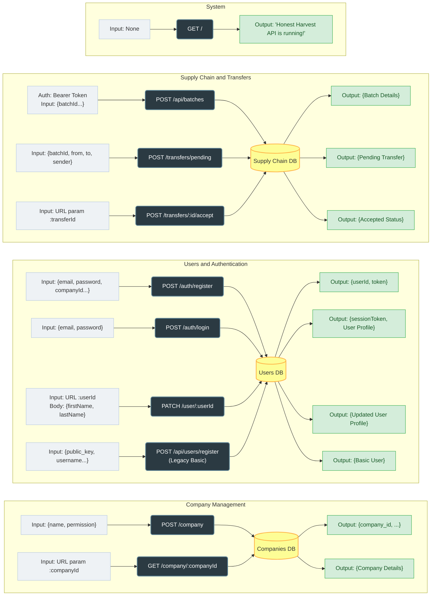

# 🌾 Honest Harvest API Documentation

**Base URL:** `http://localhost:8080`

All endpoints accept and return JSON. If an endpoint requires authentication, you must include the JWT Session Token in the headers as: `Authorization: Bearer <your_token>`.

---

## 🏢 1. Company Management

### Create a Company
Creates a new organization in the supply chain network.
* **Endpoint:** `POST /company`
* **Auth Required:** No
* **Request Input (Body):**
  ```json
  {
    "name": "",
    "permission_level": ""
  }
  ```
* **Response Output (201 Created):**
  ```json
  {
    "company_id": "",
    "name": "",
    "permission_level": "",
    "created_at": ""
  }
  ```

### Get Company Details
Fetches public details for a specific company.
* **Endpoint:** `GET /company/:companyId`
* **Auth Required:** No
* **Request Input:** `companyId` (URL Parameter)
* **Response Output (200 OK):**
  ```json
  {
    "company_id": "",
    "name": "",
    "permission_level": "",
    "created_at": ""
  }
  ```

---

## 🔐 2. Users & Authentication

### Register a User
Creates a secure user profile and links it to a company.
* **Endpoint:** `POST /auth/register`
* **Auth Required:** No
* **Request Input (Body):**
  ```json
  {
    "email": "",
    "password": "",
    "companyId": "",
    "firstName": "",
    "lastName": "",
    "role": ""
  }
  ```
* **Response Output (201 Created):**
  ```json
  {
    "userId": "",
    "registrationToken": ""
  }
  ```

### User Login
Authenticates a user and generates a JWT session token.
* **Endpoint:** `POST /auth/login`
* **Auth Required:** No
* **Request Input (Body):**
  ```json
  {
    "email": "",
    "password": ""
  }
  ```
* **Response Output (200 OK):**
  ```json
  {
    "sessionToken": "eyJhbGciOiJIUzI1NiIs...",
    "user": {
      "userID": "",
      "firstName": "",
      "lastName": "",
      "role": ""
    },
    "company": {
      "companyID": "",
      "companyName": "",
      "permission": ""
    }
  }
  ```

### Update User Profile
Updates basic profile information.
* **Endpoint:** `PATCH /user/:userId`
* **Auth Required:** No *(Should be added later)*
* **Request Input (URL Parameter + Body):**
  ```json
  {
    "firstName": "",
    "lastName": ""
  }
  ```
* **Response Output (200 OK):**
  ```json
  {
    "user_id": "",
    "public_key": null,
    "username": null,
    "email": "",
    "password_hash": "",
    "first_name": "",
    "last_name": "",
    "role": "",
    "company_id": "",
    "created_at": ""
  }
  ```

---

## 📦 3. Core Supply Chain & Transfers

### Register a New Batch
Logs a new physical product onto the network.
* **Endpoint:** `POST /api/batches`
* **Auth Required:** **Yes (Bearer Token)**
* **Request Input (Body):**
  ```json
  {
    "batchId": "",
    "productName": "",
    "originLocation": ""
  }
  ```
* **Response Output (201 Created):**
  ```json
  {
    "batch_id": "",
    "product_name": "",
    "origin_location": "",
    "ipfs_hash": null,
    "created_at": ""
  }
  ```

### Initiate a Pending Transfer
Requests to hand off a batch from one company to another.
* **Endpoint:** `POST /transfers/pending`
* **Auth Required:** No *(Should be added later)*
* **Request Input (Body):**
  ```json
  {
    "batchId": "",
    "fromCompany": "",
    "toCompany": "",
    "senderId": ""
  }
  ```
* **Response Output (200 OK):**
  ```json
  {
    "id": "",
    "batch_id": "",
    "from_company": "",
    "to_company": "",
    "sender_id": "",
    "status": "",
    "completed_at": null,
    "created_at": ""
  }
  ```

### Accept a Transfer
Completes the hand-off (triggers the blockchain transaction).
* **Endpoint:** `POST /transfers/:transferId/accept`
* **Auth Required:** No *(Should be added later)*
* **Request Input:** `transferId` (URL Parameter)
* **Response Output (200 OK):**
  ```json
  {
    "message": "",
    "data": {
      "id": "",
      "batch_id": "",
      "from_company": "",
      "to_company": "",
      "sender_id": "",
      "status": "accepted",
      "completed_at": "",
      "created_at": ""
    }
  }
  ```

---

## 🗺️ API Architecture Flow

This flowchart shows how data moves through the Honest Harvest system. 

