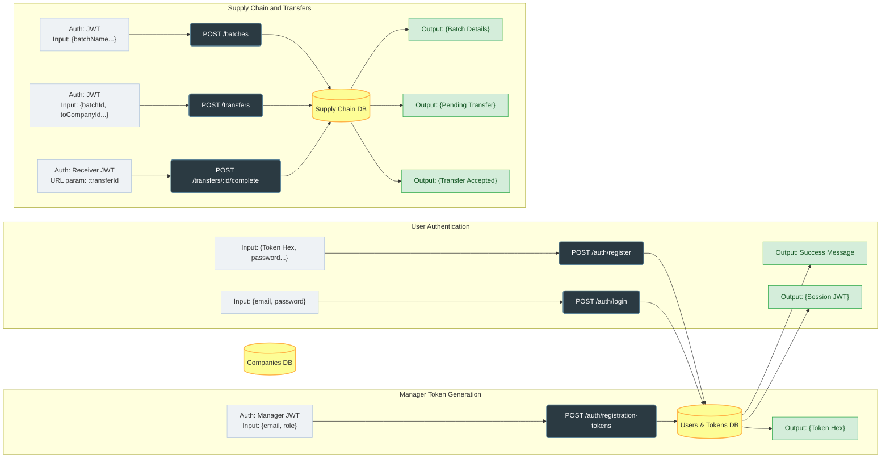

# 🌾 Honest Harvest API Documentation

**Base URL:** `http://localhost:8080`

All endpoints accept and return JSON. If an endpoint requires authentication, you must include the JWT Session Token. You can pass it either explicitly in the request body as `"sessionToken"` or in the headers as `Authorization: Bearer <your_token>`.

---

## 🔑 Security & Identity
All identity and data scoping are derived strictly from the verified Session Token. 
- The backend validates the JWT on every protected request.
- The payload injects the `userId`, `companyId`, and `role` into the request context.
- **Never** trust `userId` or `companyId` from client input for authorization decisions.

---

## 🏢 0. Utility & Company Management

### Create a Company
Creates a new organization in the supply chain network.
* **Endpoint:** `POST /company`
* **Auth Required:** No
* **Request Input (Body):**
  ```json
  {
    "name": ""
  }
  ```
Response Output (201 Created):

JSON
{
  "company_id": "uuid-string",
  "name": "Origin Farm",
  "created_at": "2026-04-22T10:00:00.000Z"
}
Get Company Details
Fetches public details for a specific company.

Endpoint: GET /company/:companyId

Auth Required: No

Request Input: companyId (URL Parameter)

Response Output (200 OK):

JSON
{
  "company_id": "uuid-string",
  "name": "Origin Farm",
  "created_at": "2026-04-22T10:00:00.000Z"
}
System Health Check
Endpoint: GET /

Auth Required: No

Response Output (200 OK): "The Honest Harvest API is running!"

🔐 1. Users & Authentication
Create Registration Token
Creates a secure token allowing a new user to join the manager's company.

Endpoint: POST /auth/registration-tokens

Auth Required: Yes (Manager Role)

Request Input (Body):

JSON
{
  "userEmail": "newuser@example.com",
  "role": "user"
}
Response Output (201 Created): Returns registrationTokenId and the hex registrationToken.

Revoke Registration Token
Invalidates a pending token so it can no longer be consumed.

Endpoint: POST /auth/registration-tokens/:id/revoke

Auth Required: Yes (Manager Role)

Response Output (200 OK): Returns updated token status ("revoked").

Get Registration Token List
Retrieves all registration tokens generated for the authenticated manager's company.

Endpoint: GET /auth/registration-tokens

Auth Required: Yes (Manager Role)

Response Output (200 OK): Array of token objects including status (pending, used, revoked).

Get Registration Token Details
Public lookup to pre-fill registration forms.

Endpoint: GET /auth/registration-tokens/:token

Auth Required: No

Response Output (200 OK): Returns associated email, company_id, company_name, and role.

Register User
Consumes a pending registration token to create a new user account linked to the company.

Endpoint: POST /auth/register

Auth Required: No

Request Input (Body):

JSON
{
  "registrationToken": "<hex-string-token>",
  "password": "securepassword123",
  "firstName": "John",
  "lastName": "Doe"
}
Response Output (201 Created): "message": "Registration successful."

User Login
Authenticates credentials and returns the JWT.

Endpoint: POST /auth/login

Auth Required: No

Request Input (Body):

JSON
{
  "email": "user@example.com",
  "password": "securepassword123"
}
Response Output (200 OK): Returns the sessionToken, user details, and company details.

User Logout
Ends a user session (client-side token deletion).

Endpoint: POST /auth/logout

Auth Required: Yes

Response Output (200 OK): "message": "Logged out successfully"

Update User Profile
Updates basic profile information. Users can only update their own profiles.

Endpoint: PATCH /users/:userId

Auth Required: Yes

Request Input (Body):

JSON
{
  "firstName": "Jonathan",
  "lastName": "Doe"
}
Response Output (200 OK): Returns updated user object.

📦 2. Core Supply Chain (Batches)
Register a New Batch
Introduces a new product lot into the system and prepares the blockchain interaction.

Endpoint: POST /batches

Auth Required: Yes

Request Input (Body):

JSON
{
  "batchName": "Organic Coffee Beans",
  "batchDescription": "100kg burlap sack, Grade A"
}
Response Output (201 Created): Returns batchId and initial blockchain state (pending).

Get Batch List
Retrieves all batches currently owned by the authenticated user's company.

Endpoint: GET /batches

Auth Required: Yes

Response Output (200 OK): Array of batch objects with their blockchain sync status.

Get Batch Details
Public lookup for the details of a specific batch.

Endpoint: GET /batches/:batchId

Auth Required: No

Response Output (200 OK): Detailed batch metadata and registering company info.

🚚 3. Transfers
Initiate Transfer
Creates a pending request to move a batch to another company. Locks the batch from other actions.

Endpoint: POST /transfers

Auth Required: Yes (Sender)

Request Input (Body):

JSON
{
  "batchId": "<uuid-of-batch>",
  "toCompanyId": "<uuid-of-destination-company>",
  "receivingUserID": "<uuid-of-destination-user>"
}
Response Output (201 Created): Returns the new transferId with status pending.

Get Transfer List
Fetches transfers where either the sender or receiver matches the authenticated user's company.

Endpoint: GET /transfers

Auth Required: Yes

Response Output (200 OK): Array of transfer objects involving the company.

Complete Transfer
Finalizes a transfer, shifting ownership to the receiving company and triggering the smart contract execution.

Endpoint: POST /transfers/:transferId/complete

Auth Required: Yes (Must be an employee of the receiving company)

Response Output (200 OK): "message": "Accepted Transfer."

Reject Transfer
Declines an incoming transfer, unlocking the batch for the original sender.

Endpoint: POST /transfers/:transferId/reject

Auth Required: Yes (Must be an employee of the receiving company)

Response Output (200 OK): "message": "Rejected Transfer."

---

## 🗺️ API Architecture Flow

This flowchart shows how data moves through the Honest Harvest system. 

