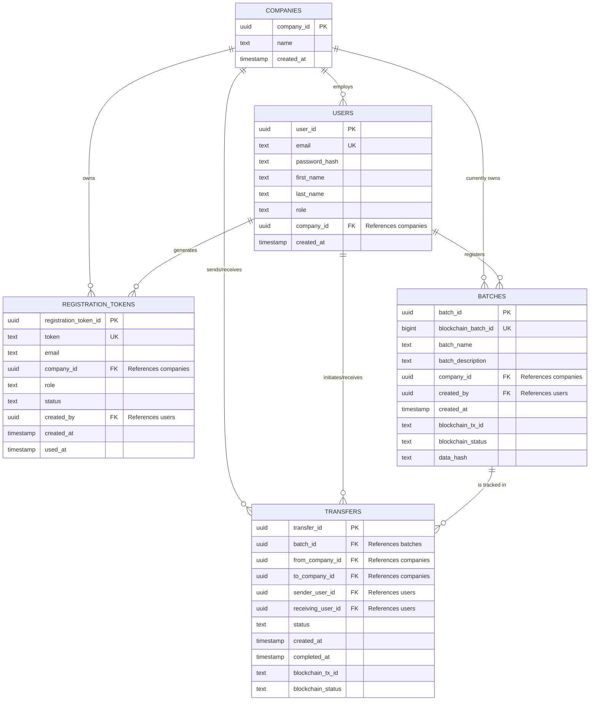

<pre>
COMPANIES {
uuid company_id PK
text name
timestamp created_at
}
USERS {
uuid user_id PK
text email UK
text password_hash
text first_name
text last_name
text role
uuid company_id FK &quot;References companies&quot;
timestamp created_at
}
REGISTRATION_TOKENS {
uuid registration_token_id PK
text token UK
text email
uuid company_id FK &quot;References companies&quot;
text role
text status
uuid created_by FK &quot;References users&quot;
timestamp created_at
timestamp used_at
}
BATCHES {
uuid batch_id PK
bigint blockchain_batch_id UK
text batch_name
text batch_description
uuid company_id FK &quot;References companies&quot;
uuid created_by FK &quot;References users&quot;
timestamp created_at
text blockchain_tx_id
text blockchain_status
text data_hash
}
TRANSFERS {
uuid transfer_id PK
uuid batch_id FK &quot;References batches&quot;
uuid from_company_id FK &quot;References companies&quot;
uuid to_company_id FK &quot;References companies&quot;
uuid sender_user_id FK &quot;References users&quot;
uuid receiving_user_id FK &quot;References users&quot;
text status
timestamp created_at
timestamp completed_at
text blockchain_tx_id
text blockchain_status
}
</pre>

---

## 🧭 Initialization

The database is fully containerized. To initialize the schema from scratch, the `init.sql` file is automatically executed when building the Docker environment.

```bash
# Wipes old volumes and builds a fresh database with the defined schema
docker-compose down -v
docker-compose up -d --build

---

# 🗄️ Honest Harvest Database Architecture

This document outlines the core PostgreSQL database schema for the Honest Harvest supply chain system.

## 🗺️ Entity-Relationship Diagram

This diagram maps how SQL tables are linked together via Primary Keys (PK) and Foreign Keys (FK).

