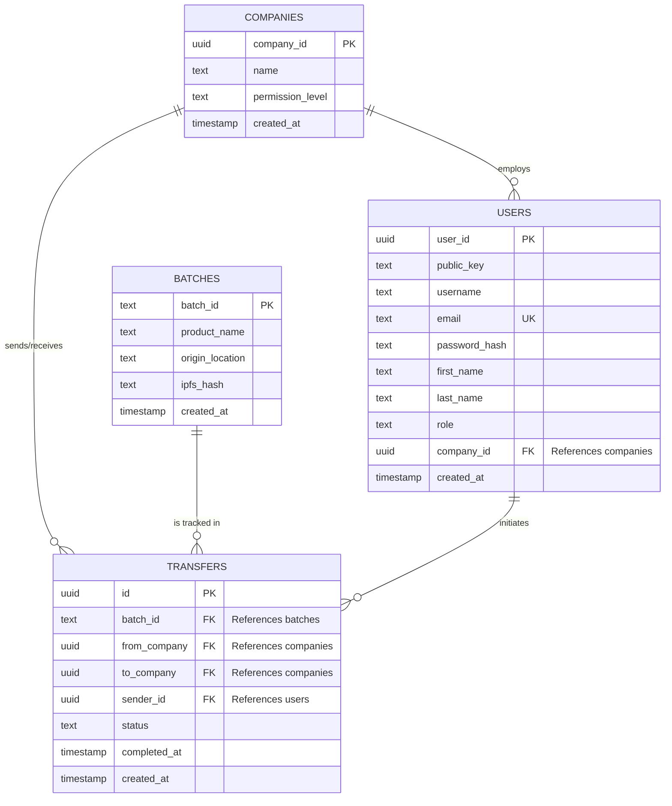

<pre>
    COMPANIES {
        uuid company_id PK
        text name
        text permission_level
        timestamp created_at
    }
    USERS {
        uuid user_id PK
        text public_key
        text username
        text email UK
        text password_hash
        text first_name
        text last_name
        text role
        uuid company_id FK &quot;References companies&quot;
        timestamp created_at
    }
    BATCHES {
        text batch_id PK
        text product_name
        text origin_location
        text ipfs_hash
        timestamp created_at
    }
    TRANSFERS {
        uuid id PK
        text batch_id FK &quot;References batches&quot;
        uuid from_company FK &quot;References companies&quot;
        uuid to_company FK &quot;References companies&quot;
        uuid sender_id FK &quot;References users&quot;
        text status
        timestamp completed_at
        timestamp created_at
    }
</pre>

---

# 🗄️ Honest Harvest Database Architecture

This document outlines the core PostgreSQL database schema for the Honest Harvest supply chain system.

## 🗺️ Entity-Relationship Diagram

This diagram maps how SQL tables are linked together via Primary Keys (PK) and Foreign Keys (FK).

